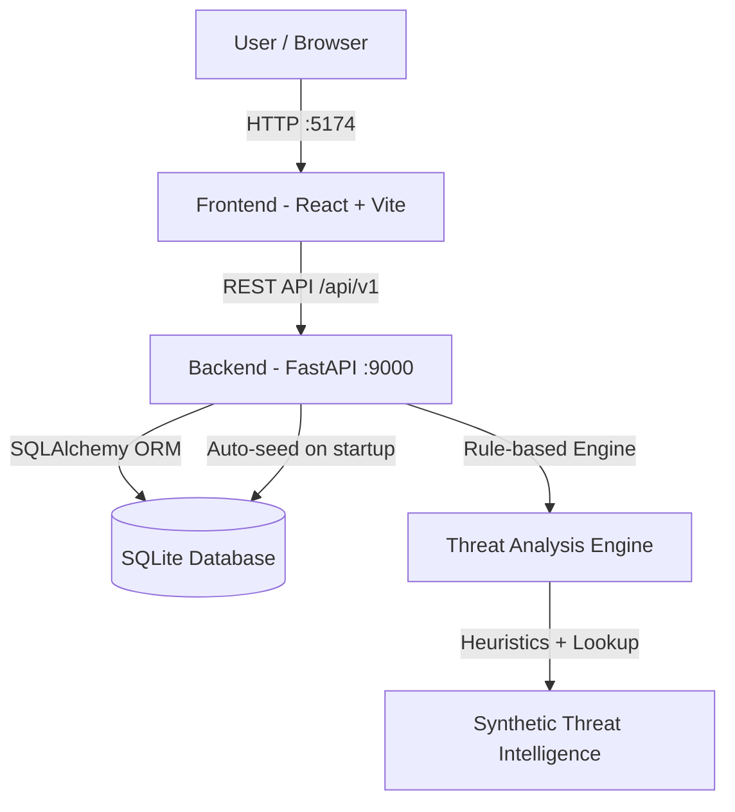

# Architecture

## System Architecture



## Components

| Component | Technology | Responsibility |
|---|---|---|
| Frontend UI | React 18 + TypeScript + Vite | Dashboard, IOC search/analysis, incident investigation |
| Backend API | FastAPI + Uvicorn | REST endpoints, business logic, data persistence |
| Analysis Engine | Pure Python (rule-based) | Risk scoring, MITRE mapping, recommendations |
| Database | SQLite + SQLAlchemy | Storing indicators, incidents, analysis history |
| Demo Data | Faker + synthetic datasets | Realistic but entirely fabricated threat data |

## Project Structure

```
src/
├── backend/
│   ├── app/
│   │   ├── core/
│   │   │   └── database.py          # SQLAlchemy engine + session
│   │   ├── models/
│   │   │   ├── indicators.py        # ThreatIndicator ORM model
│   │   │   └── incidents.py         # Incident ORM model
│   │   ├── routers/
│   │   │   ├── schemas.py           # Pydantic request/response models
│   │   │   ├── indicators.py        # /api/v1/indicators/* endpoints
│   │   │   ├── incidents.py         # /api/v1/incidents/* endpoints
│   │   │   └── dashboard.py         # /api/v1/dashboard + /demo/seed
│   │   ├── services/
│   │   │   ├── analysis.py          # Threat scoring & MITRE mapping engine
│   │   │   └── demo_data.py         # Synthetic data seeder
│   │   └── main.py                  # FastAPI app entry point
│   ├── tests/
│   │   └── test_app.py              # 18 pytest tests
│   └── requirements.txt
└── frontend/
    ├── src/
    │   ├── api/client.ts            # Axios API client
    │   ├── types/index.ts           # TypeScript interfaces
    │   ├── components/
    │   │   ├── Sidebar.tsx          # Navigation sidebar
    │   │   └── shared.tsx           # Reusable UI components
    │   ├── pages/
    │   │   ├── Dashboard.tsx        # Overview with charts
    │   │   ├── Analyze.tsx          # IOC analysis & search
    │   │   ├── Indicators.tsx       # Indicator list + filters
    │   │   └── Incidents.tsx        # Incident list + detail view
    │   ├── App.tsx                  # Router + layout
    │   └── main.tsx                 # Entry point
    ├── package.json
    └── vite.config.ts
```

## API Endpoints

| Method | Path | Description |
|---|---|---|
| `GET` | `/health` | Service health check |
| `POST` | `/api/v1/indicators/analyze` | Analyze an IOC (IP, domain, URL, hash) |
| `GET` | `/api/v1/indicators/` | List all tracked indicators |
| `GET` | `/api/v1/indicators/{id}` | Get a specific indicator |
| `PATCH` | `/api/v1/indicators/{id}/false-positive` | Toggle false-positive flag |
| `GET` | `/api/v1/incidents/` | List all security incidents |
| `GET` | `/api/v1/incidents/{id}` | Get incident details |
| `PATCH` | `/api/v1/incidents/{id}/status` | Update incident status |
| `GET` | `/api/v1/dashboard` | Aggregated dashboard statistics |
| `POST` | `/api/v1/demo/seed` | Seed synthetic demo data |

## Data Flow

1. User enters a threat indicator (IP / domain / URL / file hash) in the **Analyze IOC** page
2. Frontend sends `POST /api/v1/indicators/analyze` to the FastAPI backend
3. The **Analysis Engine** (`services/analysis.py`) classifies the indicator type and runs heuristic scoring:
   - Checks against a curated synthetic known-malicious lookup table
   - Applies rule-based scoring (suspicious TLDs, keyword matching, port analysis)
   - Maps to MITRE ATT&CK technique IDs
   - Generates tiered security recommendations
4. The result is persisted as a `ThreatIndicator` record in SQLite (or updated if already seen)
5. The API returns the full analysis result to the frontend
6. The **Dashboard** aggregates all stored indicators and incidents into charts and stats

## Threat Analysis Engine

The engine in `services/analysis.py` implements four indicator-type handlers:

| Type | Method | Key signals |
|---|---|---|
| IP address | `_score_ip()` | Known-malicious lookup, private-range detection, ASN heuristics |
| Domain | `_score_domain()` | TLD abuse list, keyword matching, subdomain depth, lookalike detection |
| URL | `_score_url()` | Domain scoring + port analysis + suspicious path patterns |
| File hash | `_score_hash()` | Known-malware hash database (MD5/SHA-1/SHA-256) |

## Security Considerations

- **No real threat intelligence is queried** — all analysis is purely synthetic and rule-based
- All `ThreatIndicator` and `Incident` records carry `is_demo_data=True`
- The demo banner is displayed in the UI on every page to ensure users understand data is simulated
- API keys are never required; no external services are called
- Input validation via Pydantic rejects empty or oversized indicator values

## Scalability Notes

The FastAPI backend is stateless and could be horizontally scaled behind a load balancer.
SQLite would need to be replaced with PostgreSQL for multi-process deployments.
The rule-based analysis engine could be extended with real threat feeds (VirusTotal, OTX, MISP).
